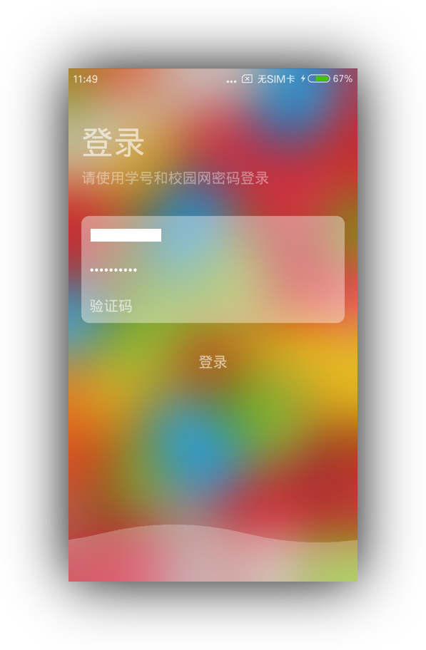
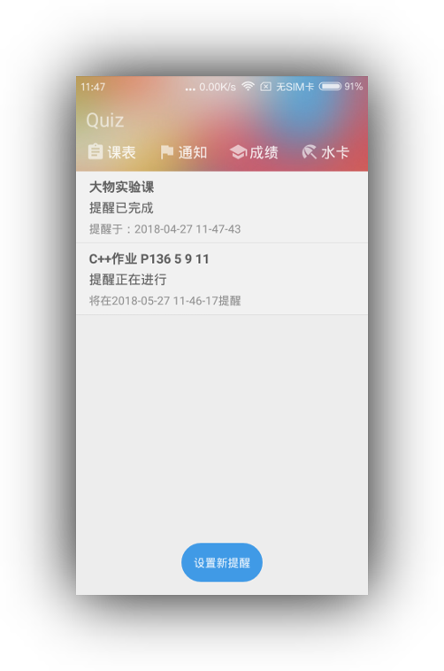
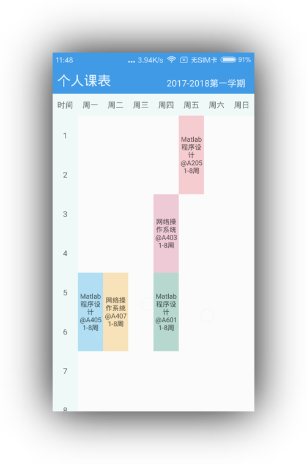
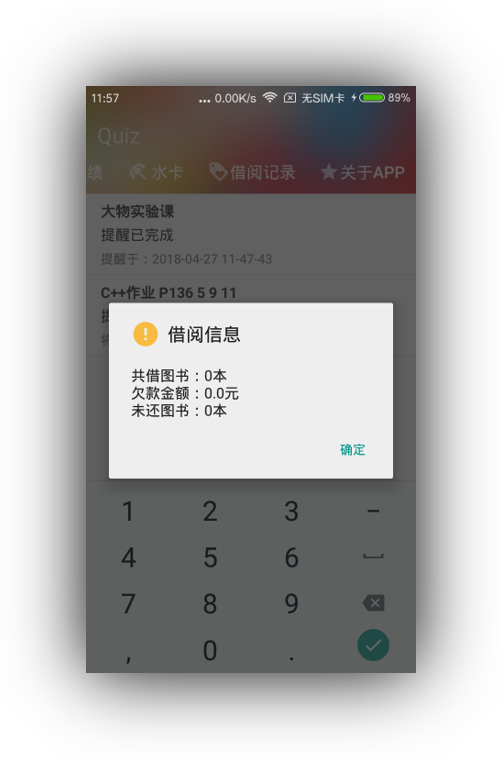
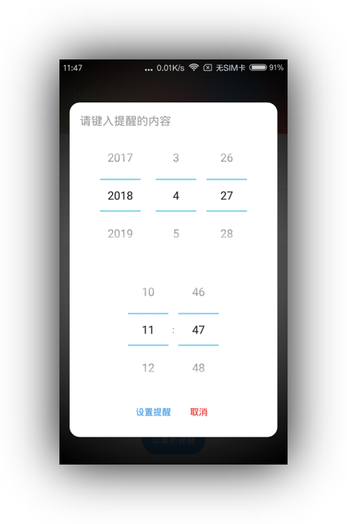

# A simple android app for my undergraduate graduation project

Hopefully, somehow you find it's useful for you.

## Q&A:
### Q: What does this app do?
A: It's basically a reduction version of the Anqing Normal University educational administration system. It's aiming to easily query the timetable, exchange homework information, query consumption information.

### Q: Does it still work?
A: Unfortunately, No. It's a rough project and the code is lacking robustness. Besides, it's a legacy code, API changes.

## Screenshots:

